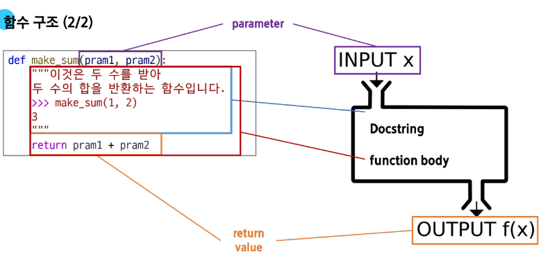

# 파이썬_260121

# 함수

- **특정 작업을 수행**하기 위한 **재사용 가능한 코드 묶음**
- 코드의 중복 방지
- 재사용성 높아짐
- 가독성, 유지보수성 향상

---

## 함수 호출 : function_name(arguments)

1. 함수 정의
2. 함수 사용(=호출)
3. 결과 확인

---

## 함수 구조

### 함수 정의

- def 키워드로 시작
- def 이후 함수 이름 작성
- 변수 안에 매개변수 정의 가능
- 매개변수 : 함수에 전달되는 값

```python
# 함수 정의
def make_sum(x, y):
    '''

    이것은 두 수를 파라미터로 받아
    두 수의 합을 반환하는 함수입니다.
    >>> maek_sum(1,2)
    3

    Docstring for make_sum
    
    :param x: Description
    :param y: Description
    '''
    result = x + y
    return result
```

---

### 함수 body

- 콜론(:) : 다음에 들여쓰기 된 크드 블록
- 함수가 실행될 때 수행되는 코드 정의

---

### Docstring

- 함수 body 앞에 선택적으로 작성 가능한 함수 설명서

---

### 함수 반환 값

- return 키워드 이후 반환할 값 명시
- return : 함수 실행 종료 + 결과를 호출 부분으로 반환
- return이 없다면 None이 반환

---

### 함수 호출

- 함수의 이름 + 소괄호
- 필요한 경우 인자 전달

---

### Print() 함수는 반환 값 X = return값 X → **중요**

- 화면에 값을 출력하기만 할 뿐
- 파이썬에서 반환 값이 없는 함수는 기본적으로 None을 반환한다고 간주

```python
# print() 함수는 반환값이 없다.
result2 = print(100)
print(result2)

def my_func():
    '''
    Docstring for my_func
    이 함수는 호출되면 터미널에 hello를 출력하는 함수입니다.
    '''
    print('hello')

result3 = my_func()
print(result3)
```

---

## 매개변수와 인자 → **중요**

### 매개변수

- 함수를 정의할 때, 함수가 받을 값을 나타내는 변수
- 아무렇게나 작성해도 OK
- But, 문법적 규칙 지키기 + 명확한 이름 권

### 인자

- 함수를 호출할 때, 실제로 전달되는 값

---

### 1. 위치 인자 (Positional Arguments)

- 함수 호출 시 인자의 위치에 따라 전달되는 인자
- 함수 호출 시 반드시 값 전달

---

### 2. 기본 인자 값 (Default Argument Values)

- 함수 정의에서 매개변수에 기본 값을 할당하는 것
- 함수 호출 시 인자 전달 X → 기본값이 할당

---

### 3. 키워드 인자 (Keyword Arguments)

- 함수 호출 시 인자의 이름과 함께 값을 전달하는 인자
- 매개변수와 인자를 일치시키지 않고, 특정 매개변수에 값 할당 가능
- 순서는 중요 X + 인자 이름 명시하여 전달
- 단, 호출 시 키워드 인자는 위치 인자 뒤에 위치

---

### 왜  위치 인자가 앞에 와야 할까?

- 순서의 모호성 때문
- 순서 의존 : 위치 인자는 첫 번째, 두 번째라는 순서에 따라 값이 전달
- 순서 파괴 : 키워드 인자는 순서를 무시하고 이름 직접 지정
- 이미 키워드 인자로 순서가 깨진 상태에서 위치 인자 →  ‘이 값이 몇 번째 자리에 들어가야 하는지’ 판단  X

---

### 4. 임의의 인자 목록 (Arbitrary Argument Lists)

- 정해지지 않은 개수의 인자를 처리하는 인자
- 함수 정의 시 매개변수 앞에 ‘*’ 붙여 사용
- 여러 개의 인자를  tuple로 처리

---

### 5. 임의의 키워드 인자 목록 (Arbitrary Keyword Argument Lists)

- 정해지지 않은 개수의 키워드 인자를 처리하는 인자
- 함수 정의 시 매개변수 앞에 ‘**’ 붙여 사용
- 여러 개의 인자를 dictionary로 묶어 처리

---

### 함수 인자 권장 작성 순서

위치 → 기본 → 가변 → 가변 키워드

- 호출 시 인자 전달 과정에서 혼란 감소
- 모든 상황에 적용되는 절대적인 규칙  X

```python
def factorial(n):
    # 종료 조건: n이 0이면 1을 반환
    if n == 0:
        return 1
    else:
        # 재귀 호출: n과 n-1의 팩토리얼을 곱한 결과를 반환
        return n * factorial(n - 1)

# 팩토리얼 계산 예시
print(factorial(5))  # 120
```

---

## 재귀 함수

- 함수 내부에서 자기 자신을 호출하는 함수
- 특정 알고리즘 식을 표현할 때, 변수의 사용 감소 + 코드의 가독성 높아짐
- 1개 이상의 base case(종료되는 상황) 존재 or 수렴하도록 작성
- 종료 조건 명확히
- 반복되는 호출이 종료 조건을 향하도록

```python
def factorial(n):
    # 종료 조건: n이 0이면 1을 반환
    if n == 0:
        return 1
    else:
        # 재귀 호출: n과 n-1의 팩토리얼을 곱한 결과를 반환
        return n * factorial(n - 1)

# 팩토리얼 계산 예시
print(factorial(5))  # 120
```

---

## 내장 함수

- 파이썬에 기본적으로 내장된 함수
- 별도의  import 없이 즉시 사용 가능
- ex) print(), len(), max(), min(), sum(), sorted()

---

## 함수와 Scope

### python의 범위

- 함수는 코드 내부에 local scope 생성
- 그 외의 공간인 global scope로 구분

---

### Scope 예시

- num은 local scope에 존재하기 때문에 global scope에서 사용 X

```python
# Scope 예시
def func():
    num = 20
    print('local', num)  # local 20

func()

print('global', num)  # NameError: name 'num' is not defined
```

---

### LEGB Rule

- sum 이라는 이름을 global scope에서 사용함으로서, 기존 built-in-scope에 있던 내장함수 sum 사용 X

```python
# 내장 함수 sum의 이름을 사용해버려서 오류가 발생하는 예시
print(sum)  # <built-in function sum>
print(sum(range(3)))  # 3
sum = 5
print(sum)  # 5
print(sum(range(3)))  # TypeError: 'int' object is not callable
```

```python
x = 'G'
y = 'G'

def outer_func():
    x = 'E'
    y = 'E'

    def inner_func(y):
        z = 'L'
        print(x, y, z)  # E P L

    inner_func('P')
    print(x, y)  # E E

outer_func()
print(x, y)  # G G
```

---

### ‘global’ 키워드

- 변수의 스코프를 전역 범위로 지정하기 위해 사용

```python
num = 0  # 전역 변수

def increment():
    global num  # num를 전역 변수로 선언
    num += 1

print(num)  # 0
increment()
print(num)  # 1

```

주의사항 1

- global 키워드 선언 전에 참조 불가

```python
# ‘global’ 키워드 주의사항 1 - global 키워드 선언 전에는 참조불가
num = 0

def increment():
    # SyntaxError: name 'num' is used prior to global declaration
    print(num)
    global num
    num += 1
```

주의사항 2

- 매개변수에는 global 키워드 사용 불가

```python
# ‘global’ 키워드 주의사항 2 - 매개변수에는 global 키워드 사용불가
num = 0

def increment(num):
    # SyntaxError: name 'num' is parameter and global
    global num
    num += 1
```

---

### 함수 이름 작성 규칙

- 소문자와 언더스코어 (_) 사용
- 동사로 시작하여 함수 동작 설명
- 약어 사용 지약

```python
# Good
def calculate_total_price(price, tax):
    return price + (price * tax)

# Bad
def calc_price(p, t):
    return p + (p * t)
```

---

### 함수 이름 구성 요소

- 동사 + 명사   ex) save_user()
- 동사 + 형용사 + 명사   ex) calculate_total_price()
- get/set 접두사   ex) get_username()

---

### 단일 책임 원칙 (Single Responsibility Principle)

- 모든 객체는 하나의 명확한 목적과 책임만을 가져야 함

---

### 함수 설계 원칙

1. **명확한 목적**
- 함수는 한 가지 작업만 수행
- 함수 이름으로 목적을 명확히 표현

1. **책임 분리**
- 데이터 검증, 처리, 저장 등을 별도 함수로 분리
- 각 함수는 독립적으로 동작 가능하도록 설계

1. **유지보수성**
- 작은 단위의 함수로 나누어 관리
- 코드 수정시 영향 범위 최소
    
    ```python
    # 잘못된 설계 예시 (여러 책임이 섞인 함수)
    def process_user_data(user_data):
        # 책임 1: 데이터 유효성 검사
        if len(user_data['password']) < 8:
            raise ValueError('비밀번호는 8자 이상이어야 합니다')
    
        # 책임 2: 비밀번호 암호화 및 저장
        user_data['password'] = hash_password(user_data['password'])
        db.users.insert(user_data)
    
        # 책임 3: 이메일 발송
        send_email(user_data['email'], '가입을 환영합니다!')
    ```
    

```python
# 올바른 설계 예시 (책임을 분리한 함수들)
def validate_password(password):
    """비밀번호 유효성 검사"""
    if len(password) < 8:
        raise ValueError('비밀번호는 8자 이상이어야 합니다')

def save_user(user_data):
    """비밀번호 암호화 및 저장"""
    user_data['password'] = hash_password(user_data['password'])
    db.users.insert(user_data)

def send_welcome_email(email):
    """환영 이메일 발송"""
    send_email(email, '가입을 환영합니다!')

# 메인 함수에서 순차적으로 실행
def process_user_data(user_data):
    validate_password(user_data['password'])
    save_user(user_data)
    send_welcome_email(user_data['email'])
```

## 패킹 (Packing)

- 여러 개의 데이터를 하나의 컬렉션으로 모아 담는 과정
- 여러 개의 값을 하나의 튜플로
- 한 변수에 콤마(,)로 구분된 값을 넣으면 자동으로 튜플로 처리

```python
packed_values = 1, 2, 3, 4, 5
print(packed_values)  # (1, 2, 3, 4, 5)
```

1. ‘*’을 활용한 패킹 (함수 매개변수 작성 시)
- 남는 위치 인자들을 튜플로 묶기

```python
# ‘*’ 을 활용한 패킹 (함수 매개변수 작성 시)
def my_func(*args):
    print(args)  # (1, 2, 3, 4, 5)
    print(type(args))  # <class 'tuple'>
    
my_func(1, 2, 3, 4, 5)
```

1. ‘**’을 활용한 패킹 (함수 매개변수 작성 시)
- 남는 키워드 인자들을 딕셔너리로 묶기

```python
# ‘**’ 을 활용한 패킹 (함수 매개변수 작성 시)
def my_func2(**kwargs):
    print(kwargs)  # {'a': 1, 'b': 2, 'c': 3}
    print(type(kwargs))  # <class 'dict’>

my_func2(a=1, b=2, c=3)

```

---

## 언패킹 (Unpacking)

- 튜플이나 리스트 등의 객체의 요소들을 개별 변수에 할당

```
packed_values = 1, 2, 3, 4, 5

# 언패킹
a, b, c, d, e = packed_values
print(a, b, c, d, e)  # 1 2 3 4 5
```

1. ‘*’을 활용한 언패킹 (함수 인자 전달)
- 리스트나 튜플 앞에 *를 붙여 각 요소를 함수의 개별 위치 인자로 전달

```python
# ‘*’ 을 활용한 언패킹 (함수 인자 전달)
def my_function(x, y, z):
    print(x, y, z)

names = ['alice', 'jane', 'peter']
my_function(*names)  # alice jane peter
```

1. ‘**’을 활용한 언패킹 (딕셔너리 → 함수 키워드 인자)
- 딕셔너리 앞에 **를 붙여 {키: 값} 쌍을 키=값 형태의 키워드 인자로 전달

```python
# ‘**’을 활용한 언패킹 (딕셔너리 -> 함수 키워드 인자)
def my_function(x, y, z):
    print(x, y, z)

my_dict = {'x': 1, 'y': 2, 'z': 3}
my_function(**my_dict)  # 1 2 3
```



---

## 람다 표현식

- 익명 함수를 만드는데 사용되는 표현식
- 한 줄로 간단한 함수를 정의

### 람다 표현식 구조

1. lambda 키워드
2. 매개변수
3. 표현식

```python
# 람다 표현식 적용 전
def addition(x, y):
    return x + y

# 람다 표현식 적용 후

"""
람다 표현식 활용 (with sorted 함수)
sorted() 함수는 리스트를 정렬해주며, key라는 매개변수에 함수를 전달하여 
"무엇을 기준으로 정렬할지"를 지정할 수 있습니다. 
이때 간단한 기준을 제시하기 위해 lambda를 사용하는 것이 매우 효과적입니다.

예시: 학생들의 점수를 나이순으로 정렬하기
학생 데이터가 (이름, 나이) 형태의 튜플로 묶여있는 리스트가 있다고 가정해 봅시다

# 목표: 학생들을 '나이'가 어린 순서대로 정렬하고 싶다!
"""
# 학생 데이터가 (이름, 나이) 형태의 튜플로 묶여있는 리스트
students = [('지민', 25), ('서준', 20), ('민우', 30)]

# 1. lambda 미사용
# 정렬 기준 함수를 굳이 정의해야 함
def get_age(student):
    return student[1]

# sorted 함수의 key 매개변수에 우리가 만든 get_age 함수를 전달
result = sorted(students, key=get_age)
print(result)  # [('서준', 20), ('지민', 25), ('민우', 30)]

# 2. lambda 사용
"""
get_age처럼 간단하고 한 번만 쓸 함수를 굳이 따로 정의할 필요 없이, lambda로 즉석에서 만들어 전달할 수 있습니다.
key=lambda student: student[1]
-> "정렬할 때 각 데이터를 student라고 부를게."
-> "그리고 그 데이터의 1번 인덱스 값(나이)을 기준으로 삼아줘."
"""
result = sorted(students, key=lambda student: student[1])
print(result)  # [('서준', 20), ('지민', 25), ('민우', 30)]

```